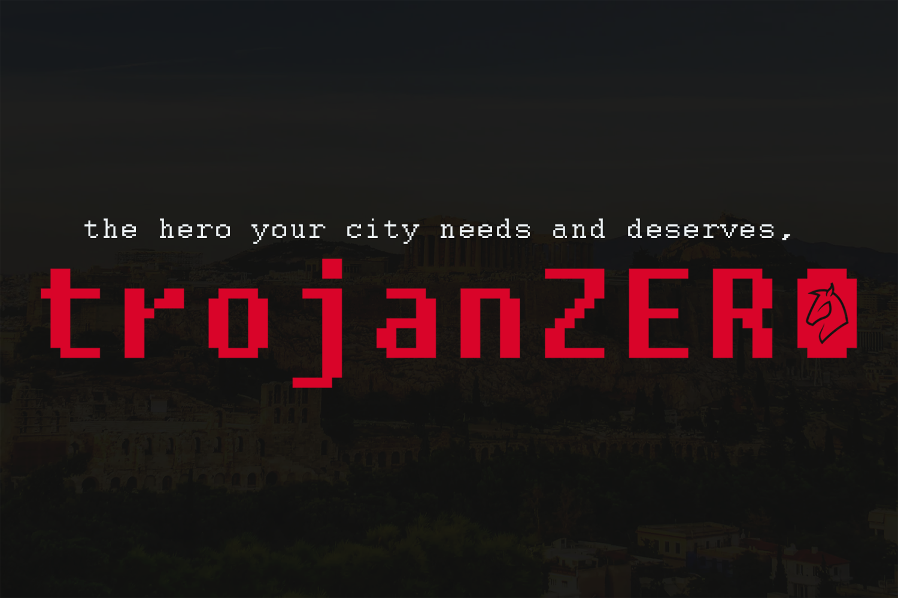

# 
_**Created by:** Imesh Nimsitha, Arshvir Chaudary, Yash Patel, Ronit Ahuja_

## Installation

Use the free, open-source web server package [XAMPP](https://www.apachefriends.org/index.html) to deploy the website locally.
Place the website's source code folder into `(Location of xampp folder)\htdocs`

It is also possible to deploy the website publicly using a web host - be aware that some functionality may change, as the source code was intended for deploying locally.

## Usage
To test an administrator's experience within the website, use the following account credentials when logging in.
>**Email:** admin@trojanzero.com

>**Password:** 1234567 

To test a guard's experience within the website, use the following account credentials when logging in.
>**Email:** demetrius@troy.com

>**Password:** qwerty

Explore the website with this specific flow for the best user experience:
```
> index.php
> login.php OR register.php (depending on chosen role experience)
> panel\
> panel\cameras.php
> panel\users.php
> panel\analytics.php
> panel\account.php
```

## Inspiration
In technology, a trojan virus is a type of malware that hides itself in what appears to be a normal file. The term was coined after the story of the hollow wooden horse, which was used by the sneaky Greek soldiers to trick the defenders of Troy into accepting a “gift”. Inspired by this infamous defeat of the City of Troy at the hands of the Greeks, trojanZERO was created with the intent of becoming a security measure that will prevent enemies from infiltrating a city.

## Overview
With the usage of thermal technology, trojanZERO uses thermal cameras to detect heat signatures within wagons and other large constructs that pass through the city borders. In the case of a triggered warning detection, the city officials and guards that are added to the administration panel will receive alerts, allowing them to have a chance at taking the necessary actions to save their city.

In addition, trojanZERO provides users with various features to streamline and protect the integrity of a city’s physical security network. With the ability to grant and revoke access to the thermal cameras, city officials are able to keep track of who can view the camera at all times. Advanced analytics, which include prediction-based detections and statistical models, are also provided to the administrators to assist with decision-making processes.

## Frameworks & Languages
The clean UI was designed using the Bootstrap framework, along with its language dependencies of HTML, CSS and sCSS. All backend development was done using Javascript, jQuery and PHP. To store users and other data, Google’s Firebase authentication and database modules were integrated. Rendering all analytics into an aesthetically pleasing, readable format was done using the Chart.js API. The minimalist administration panel is used to access and connect every other feature together, which includes thermal security cameras, user information and analytics. Accessibility, smooth UI, and ease of access were all kept in mind when creating the website. Customers will be able to easily purchase and use the software.

## Challenges
Thermal imagery on a website is difficult in this day and age, as several webcams are not equipped with the technology to support thermal imagery. As of right now, the prototype does not come with a physical thermal camera. However, in the scenario where capable cameras are installed, the camera footage and information will be accessed and displayed on the administration panel.

## Accomplishments
* Designing the beautiful minimalistic user interface - allowing for different users to access/control the features of our service through an administration panel
* Integration of Google’s Firebase - keeping data secure using high-grade authentication and database systems
* Developing a smooth UX - easy to understand flow for all types of user experiences.

## Learning Experiences
While developing trojanZERO, we realized how many of the greatest historical events could have progressed differently with the aid of technology. This experience of solving a past issue has shown how technology is crucial and relied upon in modern society. The distinct topic allowed for an innovative and inventive solution to be created. Every group member also learned more about programming in languages such as Javascript and PHP. Every team member learned how to create a user authentication system and database using Firebase for the first time. Also, a lot of time was spent learning how to design a fluid and accessible UI/X for the customers’ ease of access. 

## Next Steps
World-wide domination! - but on a real note, the next steps include purchasing thermal cameras that are portable and easy-to-mount in various locations. Once these cameras are purchased, they must be connected and integrated into the administration panel as live feeds. In terms of the business aspect, the company will have to upscale by using services that allow for a plethora of users and data to be hosted, as thermal imaging is not a lightweight feature. Ultimately, it will come down to the dedication and persistence of the team.
